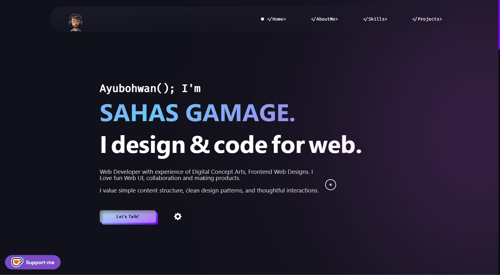

# Dev Modern Portfolio

A modern, responsive developer portfolio built to showcase projects, technical skills, and scalable web solutions.

---

## Overview

This portfolio represents a clean and structured approach to personal branding as a developer.  
Designed with performance, simplicity, and professional presentation in mind.

---

## Features

- Fully Responsive Design
- Clean and Minimal UI
- Performance Optimized
- SEO-Friendly Structure
- Modular & Maintainable Codebase

---

## Sections Included

- Hero Introduction
- About
- Skills
- Projects Showcase
- Services
- Contact

---

## Tech Stack

Depending on deployment version:

- HTML5 / CSS3
- JavaScript
- React / Next.js (optional version)
- Tailwind CSS

---

## Purpose

This project serves as:

- A professional online presence
- A showcase of development capability
- A foundation for future expansion

---

## Author

Sahas Gamage  
Founder — Code by SG  
Web Developer

---

© 2026 All rights reserved.
